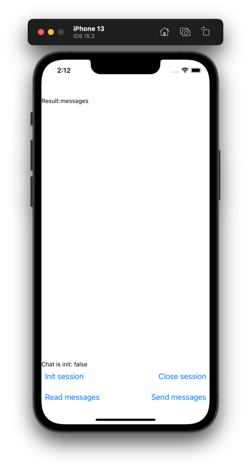
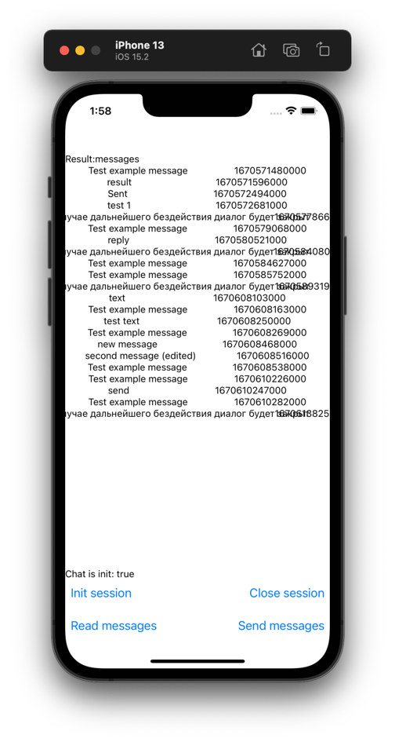
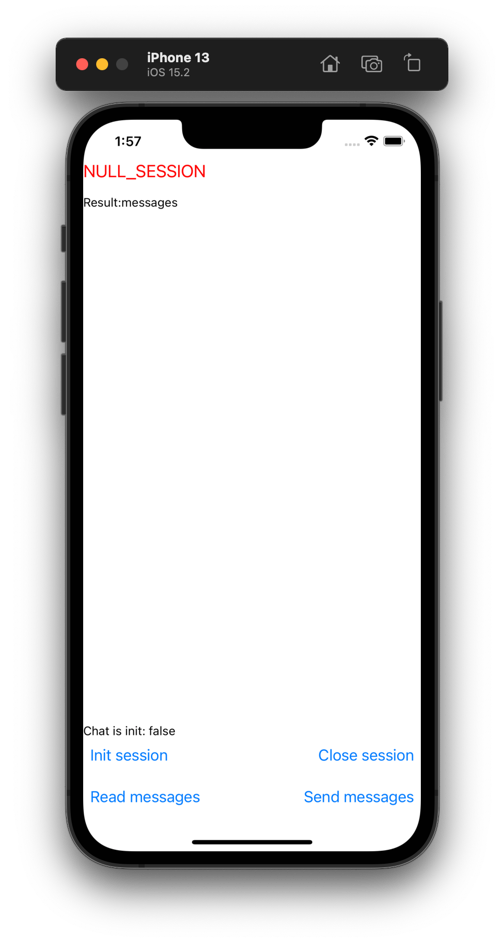
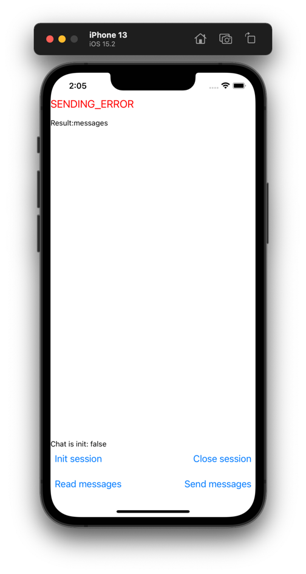
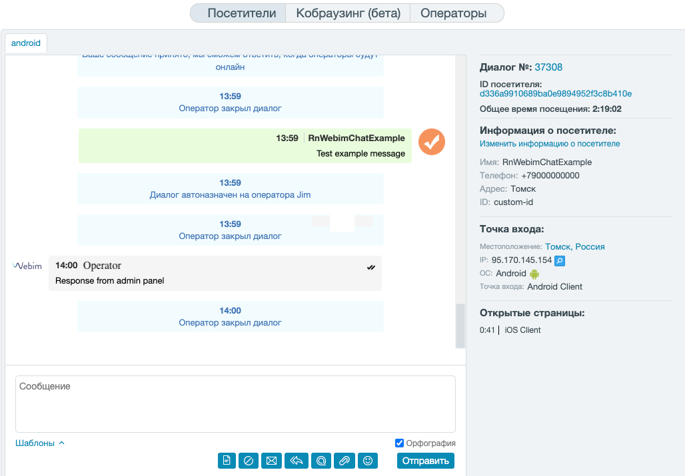

# rn-webim-chat

Implementation of [webim sdk](https://webim.ru/) for [react-native](https://github.com/facebook/react-native)

_Inspired by [volga-volga/react-native-webim](https://github.com/volga-volga/react-native-webim)_
___

## Installation
- Requires React Native version 0.60.0, or later.
- Supports iOS 10.0, or later.

Via NPM
```sh
npm install rn-webim-chat
```

Via Yarn
```sh
yarn add rn-webim-chat
```

#### :iphone:iOS (_Extra steps_)
- add to PodFile     `use_frameworks!`
- add `WebimClientLibrary` to Podfile with specific version (_Wrapper was written for v3.37.4_)
- pod install

see [example Podfile](./example/ios/Podfile)

**Note:** Flipper doesn't work with **use_frameworks** flag

Since the official [WebimClientLibrary](https://github.com/webim/webim-client-sdk-ios) is written is Swift, you need to have Swift enabled in your iOS project. If you already have any .swift files, you are good to go. Otherwise create a new empty Swift source file in Xcode, and allow it to create the neccessary bridging header when prompted.

## Example
In [example folder](./example) there is simple workflow how to:
 - Start and destroy session
 - Get and Send messages
 - Handle errors

How it looks like you can see here

<table align="Center">
  <tr>
    <td>Not init session</td>
    <td>Requested messages</td>
  </tr>
  <tr>
    <td></td>
    <td></td>
  </tr>
 </table>
 
 
<table align="Center">
  <tr>
     <td>Error getMessages (as session is null)</td>
     <td>Error sendMessage (as session is null)</td>
  </tr>
  <tr>
    <td></td>
    <td></td>
  </tr>
 </table>


## Methods

**Important:** All methods are promise based and can throw exceptions.
List of error codes will be provided later as get COMMON for both platform.

### Init chat

 ```ts
import { RNWebim } from 'rn-webim-chat';

RNWebim.resumeSession(builderParams: SessionBuilderParams)
```
**SessionBuilderParams:**
- accountName (required) - name of your account in webim system
- location (required) - name of location. For example "mobile"
- accountJSON - encrypted json with user data. See [**Start chat with user data**](#start-chat-with-user-data)
- clearVisitorData - clear visitor data before start chat
- storeHistoryLocally - cache messages in local store
- title - title for chat in webim web panel
- providedAuthorizationToken - user token. Session will not start with wrong token. Read webim documentation
- pushToken - FCM token is enough - but Aple pushes will come through APN, so you are not able to process them in app by default.
- appVersion


### Init events listeners

```js
import { RNWebim,  WebimEvents} from 'rn-webim-chat';

const listener = RNWebim.addNewMessageListener(({ msg }) => {
  // do something
});
// usubscribe
listener.remove();

// or
const listener2 = RNWebim.addListener(WebimEvents.NEW_MESSAGE, ({ msg }) => {
    // do something
});
```
Supported events (`WebimEvents`):
- WebimEvents.NEW_MESSAGE;
- WebimEvents.REMOVE_MESSAGE;
- WebimEvents.EDIT_MESSAGE;
- WebimEvents.CLEAR_DIALOG;
- WebimEvents.TOKEN_UPDATED;
- WebimEvents.ERROR;

### Get messages

```js
const { messages } = await RNWebim.getLastMessages(limit);
// or
const { messages } = await RNWebim.getNextMessages(limit);
// or
const { messages } = await RNWebim.getAllMessages();
```

**Message type**
```ts
{
  id: string;
  avatar?: string;
  time: number;
  type: 'OPERATOR' | 'VISITOR' | 'INFO';
  text: string;
  name: string;
  status: 'SENT';
  read: boolean;
  canEdit: boolean;
  carReply: boolean;
  quote?: any; // no typing yet
  attachment?: WebimAttachment;
}
```
Note: method `getAllMessages` works strange on iOS, and sometimes returns empty array. We recommend to use `getLastMessages` instead

### Send text message

```
RNWebim.send(message);
```

### Attach files

#### Use build in method for file attaching:

```js
try {
  await RNWebim.tryAttachFile();
} catch (err) {
  /*
   process err.message:
    - 'file size exceeded' - webim response
    - 'type not allowed' - webim response
    - 'canceled' - picker closed by user
   */
}
```

#### or attach files by yourself

```js
try {
  RNWebim.sendFile(uri, name, mime, extension)
} catch (e) {
  // can throw 'file size exceeded' and 'type not allowed' errors
}
```

### Rate current operator
```js
RNWebim.rateOperator()
```

### Destroy session
```js
RNWebim.destroySession(clearData);
```

- clearData (optional) boolean - If true wil

## Start chat with user data
**Tl;DR;**
You have to generate private key in your Webim Account and kinda sign your user fields values.
For more details see [webim documentation](https://webim.ru/kb/dev/identification/id-2-0.html) for client identification.

in [Example app](./example) there is code how to achieve it.
Example:

I'd recommend to you use some lightweight library. HMAC-256 is enough. Actually you can use md5 algorithm  - but I'd avoid it.
There are some other aproches e.g. with JsCrypto or with [react-native-crypto ](https://github.com/tradle/react-native-crypto). But here you need to hash all your modules.
Like [here](https://github.com/volga-volga/react-native-webim#start-chat-with-user-data). But the choice it is up to you!

- install [js-sha256](https://github.com/emn178/js-sha256)
- write hash-function to sign your fields.
- use it in your app.

```ts
// chat-utils.ts file
import { sha256 } from 'js-sha256';

const getHmac_sha256 = async (str: string, privateKey: string) => {
  return sha256.hmac(privateKey, str);
};

/**
 * Returns hash value for authorized user.
 * @param obj - User's json fields.
 * @param privateKey - private key value. By that hash will be generated.
 */
export const getHashForChatSign = async (
  obj: { [key: string]: string },
  privateKey: string
) => {
  const keys = Object.keys(obj).sort();
  const str = keys.map((key) => obj[key]).join('');
  return await getHmac_sha256(str, privateKey);
};
```

```tsx
// App.tsx file
...
import { getHashForChatSign } from './chat-utils';

const PRIVATE_KEY = 'YOUR-PRIVATE-KEY-FROM-PORTAL';
const CHAT_SERVICE_ACCOUNT = 'YOU-ACCOUNT';

const acc = {
  fields: {
    id: 'some-id',
    display_name: '1.0.0',
    phone: '+79000000000',
    address: 'Tomsk',
  },
  hash: '',
};

async function intSession() {
  acc.hash = await getHashForChatSign(acc.fields, PRIVATE_KEY);
  const sessionsParams = {
    accountName: CHAT_SERVICE_ACCOUNT,
    location: '',
    storeHistoryLocally: true,
    accountJSON: JSON.stringify(acc),
    appVersion: AppConfig.version,
    clearVisitorData: true,
  };

  await RNWebim.resumeSession(sessionsParams);
  console.log('[Chat][Init] initialized with params: ', sessionsParams);
};

...
```


## Contributing
See the [contributing guide](CONTRIBUTING.md) guide to learn how to contribute to the repository and the development workflow.

## License
Software provided as it is.
It will be maintained time-to-time. Currently, I have to use this package in some applications, so I try to keep it on working.
If you want to help or improve something see section #Contributing


---

Made with [create-react-native-library](https://github.com/callstack/react-native-builder-bob)
