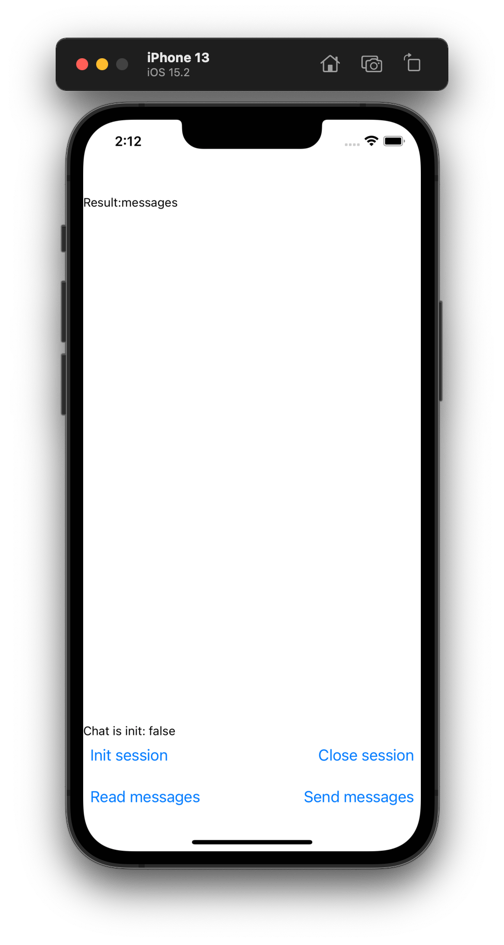
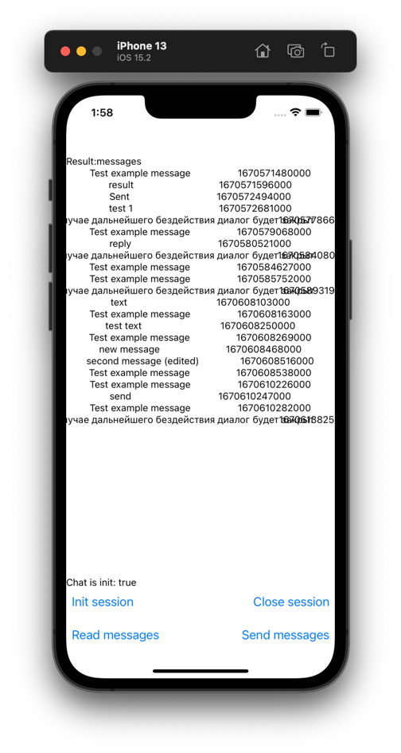
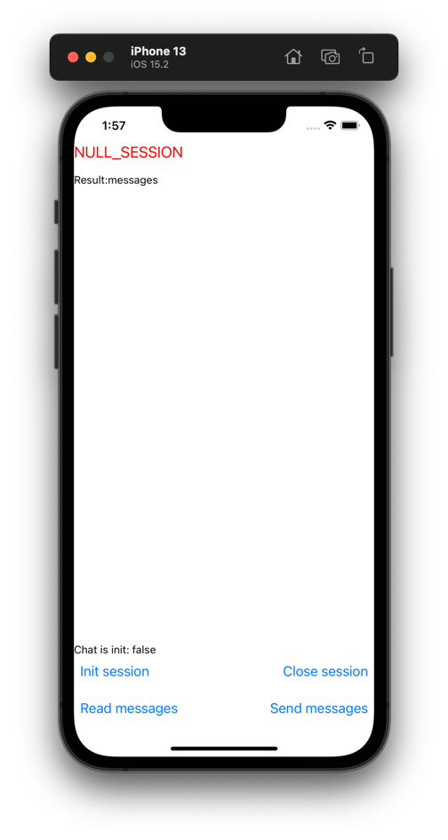
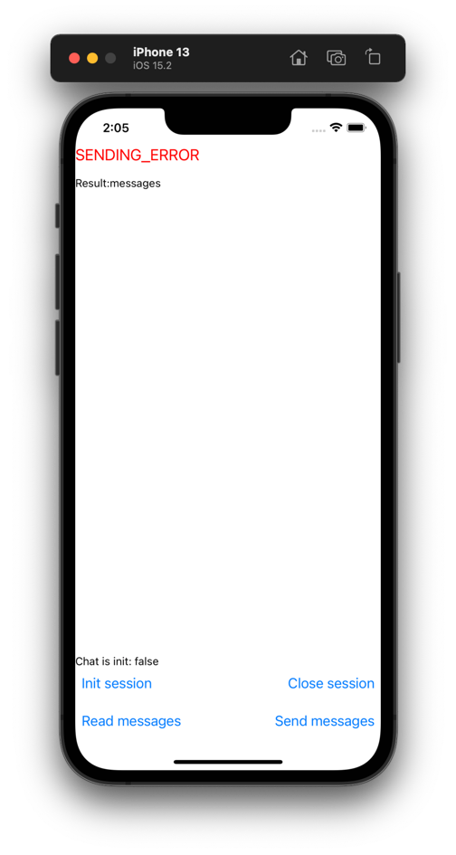
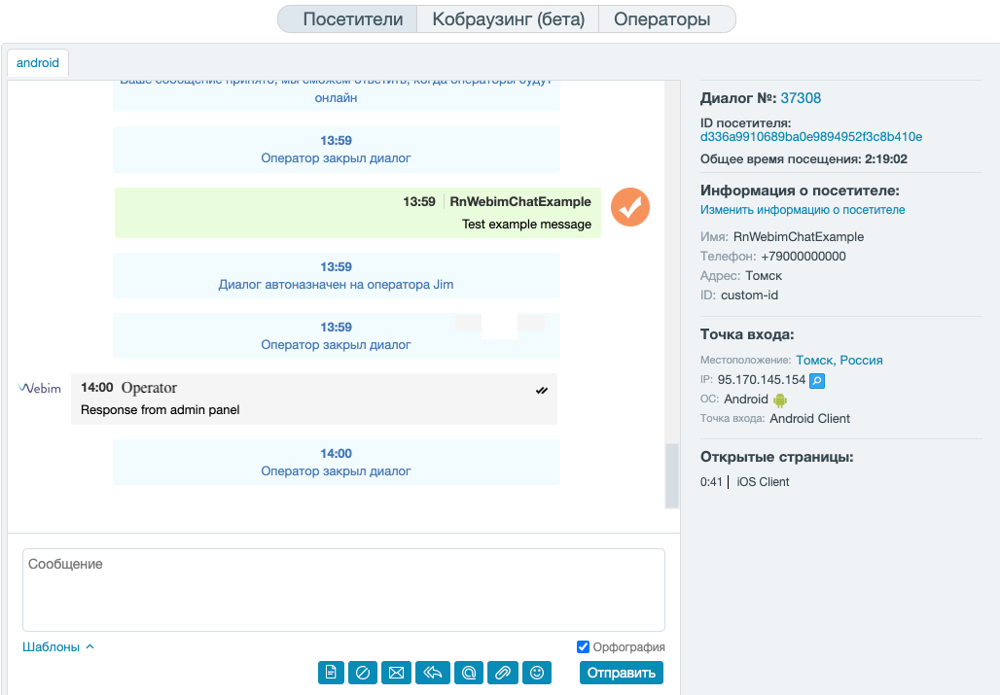

# rn-webim-chat

Implementation of [webim sdk](https://webim.ru/) for [react-native](https://github.com/facebook/react-native)

_Inspired by [volga-volga/react-native-webim](https://github.com/volga-volga/react-native-webim)_

<!-- BADGES/ -->

[](https://github.com/mav10/rn-webim-chat/actions/workflows/npm-publish.yml)
<span class="badge-npmversion"><a href="https://www.npmjs.com/package/rn-webim-chat" title="View this project on NPM"></a></span>
<span class="badge-npmdownloads"><a href="https://www.npmjs.com/package/rn-webim-chat" title="View this project on NPM"></a></span>

<!-- /BADGES -->

---

## Platforms:


## Installation

- Validated with React Native 0.87.1 and the New Architecture enabled in the example. The native module continues to use React Native's legacy-module interop and does not require TurboModule codegen.
- Requires iOS 15.1 or later.
- The example pins Webim Android SDK 4.1.4 and iOS SDK 4.0.1.

Via NPM

```sh
npm install rn-webim-chat
```

Via Yarn

```sh
yarn add rn-webim-chat
```

#### :iphone:iOS (_Extra steps_)

- add `WebimMobileSDK` to Podfile with the version used by this wrapper (`4.0.1`)
- pod install

see [example Podfile](./example/ios/Podfile)

Since the official [WebimClientLibrary](https://github.com/webim/webim-client-sdk-ios) is written is Swift, you need to have Swift enabled in your iOS project. If you already have any .swift files, you are good to go. Otherwise, create a new empty Swift source file in Xcode, and allow it to create the neccessary bridging header when prompted.

## Example

In [example folder](./example) there is simple workflow how to:

- Start and destroy session
- Resume and Pause session
- Get and Send messages
- Rate operator
- Handle errors

How it looks like you can see here
It is achieved with [simple UI](./example/src/simple) (just test common methods)

<table align="Center">
  <tr>
    <td>Not init session</td>
    <td>Requested messages</td>
  </tr>
  <tr>
    <td></td>
    <td></td>
  </tr>
 </table>

<table align="Center">
  <tr>
     <td>Error getMessages (as session is null)</td>
     <td>Error sendMessage (as session is null)</td>
  </tr>
  <tr>
    <td></td>
    <td></td>
  </tr>
 </table>



_Also there is another [example with chat UI](./example/src/withCustomUI) [`react-native-gifted-chat`](https://github.com/FaridSafi/react-native-gifted-chat)_

## Methods

**Important:** All methods are promise based and can throw exceptions.
List of error codes will be provided later as get COMMON for both platform.

### Init chat

```ts
import { RNWebim } from 'rn-webim-chat';

await RNWebim.initSession(builderParams: SessionBuilderParams)
```

**SessionBuilderParams:**

- accountName (required) - name of your account in webim system
- location (required) - name of location. For example "mobile"
- accountJSON - JSON string containing server-signed visitor fields (not encrypted). See [**Start chat with user data**](#start-chat-with-user-data)
- clearVisitorData - clear visitor data before start chat
- storeHistoryLocally - cache messages in local store
- historyTimeoutMs - iOS timeout for `getLastMessages` and `getNextMessages` in milliseconds (default `18000`, range `1-20000`). On timeout, the promise rejects with `HISTORY_TIMEOUT`; late SDK callbacks are ignored. This does not disable local history or silently change the session configuration.
- debug - enable verbose iOS Webim SDK logs. Subscribe with `RNWebim.addLogListener`; logs can contain request/response data, so enable only for controlled diagnostics and avoid forwarding them to public logs.
- title - title for chat in webim web panel
- providedAuthorizationToken - user token. Session will not start with wrong token. Read webim documentation
- pushToken - native APNs hexadecimal device token on iOS, FCM registration token on Android. Do not use an FCM token for direct iOS APNs.
- pushSystem - `none`, `apns` (iOS), or `fcm` (Android). Set it before a token is available; use `RNWebim.setPushToken(token)` when registration or refresh completes.
- appVersion - version of your Application
- prechat - some additional fields to prechat

### Multiple Attachments

These APIs are implemented in the current source, not the previously published
2.2.1 package. Each group becomes **one message**, not one message per file.
Both SDKs support up to 10 uploaded files, subject to Webim server support and
account limits. Verify this on your account before enabling grouped selection.

```ts
const files = await RNWebim.tryAttachFiles({ kind: 'documents', maxFiles: 10 });
const message = await RNWebim.sendFiles(files, {
  onProgress: ({ completedFiles, totalFiles, phase }) => {
    updateUploadState({ completedFiles, totalFiles, phase });
  },
});
```

Use `kind: 'media'` for photos/videos, or pass your own local files directly to
`sendFiles`. `tryAttachAndSendFiles(options)` combines selection and sending.
Messages include `attachments[]`; `attachment` remains the first-file alias.
Existing single-file methods remain available. See [attachment lifecycle](doc/attachments.md)
for cancellation, retry, low-level upload handles, and uncertain commit errors.

### Push Notifications

Core exports `normalizeWebimNotification` and `createWebimNotificationController`
for integration with an existing notification stack. The optional companion
under [packages/notifications](packages/notifications/README.md) supplies Notifee
display/events, direct APNs forwarding, and an Android Firebase adapter. It is
not a dependency of the core, and neither package provides a chat UI.

```ts
await RNWebim.initSession({
  accountName: 'your-account',
  location: 'mobile',
  pushSystem: Platform.OS === 'ios' ? 'apns' : 'fcm',
});
// Forward the actual platform device token, including refresh:
await RNWebim.setPushToken(deviceToken);
```

iOS background notifications use Webim localization keys in the host app's
main bundle. Notifee does not replace APNs registration or rewrite background
content through JavaScript. The text/sound/open-chat recipe needs no notification
service extension. See [notification setup](doc/notifications.md) for ready and
external modes, native forwarding, localized defaults, and cold-start routing.

### Resume session

If you have already initialized a session you should **resume** it to consume and send messages, get actual information by listeners etc.
On iOS the returned promise waits for the SDK connection and rejects with
`SESSION_RESUME_TIMEOUT` if it is not connected within 20 seconds. On Android,
the SDK exposes no equivalent connection-completion callback, so the promise
resolves once the synchronous resume request has been accepted.

**NOTE:** _After that execution operator on web chat will get message that user opens a chat._

```ts
import { RNWebim } from 'rn-webim-chat';

await RNWebim.resumeSession();
```

### Pause session

If you have already initialized a session you should **resume** it to consume and send messages, get actual information by listeners etc.
After that execution operator on web chat will get message that user opens a chat.

```ts
import { RNWebim } from 'rn-webim-chat';

await RNWebim.pauseSession();
```

### Init events listeners

```js
import { RNWebim, WebimEvents } from 'rn-webim-chat';

const listener = RNWebim.addNewMessageListener((msg) => {
  // do something
});
// usubscribe
listener.remove();

// or
const listener2 = RNWebim.addListener(WebimEvents.NEW_MESSAGE, (msg) => {
  // do something
});
```

Supported events (`WebimEvents`):

- WebimEvents.NEW_MESSAGE;
- WebimEvents.REMOVE_MESSAGE;
- WebimEvents.EDIT_MESSAGE;
- WebimEvents.CLEAR_DIALOG;
- WebimEvents.TOKEN_UPDATED;
- WebimEvents.ERROR;
- WebimEvents.LOG (iOS SDK diagnostics; enabled with `debug: true`);
- WebimEvents.STATE;
- WebimEvents.UNREAD_COUNTER;
- WebimEvents.TYPING;

- ~~WebimEvents.FILE_UPLOADING_PROGRESS;~~

### Get messages

As you called `getAllMessages` after that you should call `nextMessages` as reading "all messages" during the same session will get no result (native implementation uses holder and cursor by last loaded message)

```js
const { messages } = await RNWebim.getLastMessages(limit);
// or
const { messages } = await RNWebim.getNextMessages(limit);
// or
const { messages } = await RNWebim.getAllMessages();
```

On iOS, `getLastMessages` and `getNextMessages` reject with
`{ errorCode: 'HISTORY_TIMEOUT', message, errorType: 'fatal' }` after
`historyTimeoutMs` if the SDK does not invoke its completion. The default
18-second timeout bounds a stalled local history read; it does not prove that
the underlying SQLite history is healthy. For diagnosis, initialize with
`debug: true` and subscribe to `RNWebim.addLogListener`. If local history hangs,
record SDK/device/account configuration and retry only after explicitly
destroying and rebuilding the session with `storeHistoryLocally: false` if
server-side history is acceptable for the product. The library does not switch
storage modes automatically.

Native errors and `error` events use `{ errorCode, message, errorType }`.
Known server codes `wrong-argument-value` and `account-not-found` map to
`INVALID_ARGUMENT_VALUE` and `ACCOUNT_NOT_FOUND`; `message` retains the SDK's
original text. Fatal and non-fatal SDK callbacks are forwarded to
`RNWebim.addErrorListener`.

**Message type**

```typescript
export type WebimMessage = {
  id: string;
  serverSideId: string;
  avatar?: string;
  time: number;
  type: MessageTypeAlias; // 'OPERATOR', 'VISITOR', 'INFO', 'ACTION_REQUEST', 'CONTACTS_REQUEST', 'FILE_FROM_OPERATOR', 'FILE_FROM_VISITOR', 'OPERATOR_BUSY', 'KEYBOARD', 'KEYBOARD_RESPONSE';
  text: string;
  name: string;
  status: 'SENT' | 'SENDING';
  read: boolean;
  canEdit: boolean;
  canReply: boolean;
  isEdited: boolean;
  canReact: boolean;
  canChangeReaction: boolean;
  visitorReaction?: string;
  stickerId?: number;
  keyboard?: {
    buttons: Array<Array<{ id: string; text: string }>>;
    state: 'PENDING' | 'COMPLETED' | 'CANCELED' | 'CANCELLED';
    response?: string;
  };
  keyboardRequest?: {
    button?: { id: string; text: string };
    messageId?: string;
  };
  quote?: Quote;
  attachment?: WebimAttachment;
  operatorId?: string;
};
```

**Quote type**

```typescript
export type Quote = {
  authorId?: string;
  senderName: string;
  messageId: string;
  messageText: string;
  messageType: MessageTypeAlias;
  state: 'FILLED' | 'NOT_FOUND' | 'PENDING';
  timestamp: Date | number;
  attachment?: WebimAttachment;
};
```

**Included attachment**

```typescript
export interface WebimAttachment {
  contentType: string;
  info: string;
  name: string;
  size: number;
  url: string;
}
```

Note: method `getAllMessages` works strange on iOS, and sometimes returns empty array. We recommend to use `getLastMessages` instead

### Send text message

```typescript
import RNWebim from 'rn-webim-chat';

const messageId = await RNWebim.send(message);
```

Update or clear the visitor typing draft with `setVisitorTyping`:

```typescript
await RNWebim.setVisitorTyping('I am writing a message');
await RNWebim.setVisitorTyping(null);
```

### Reply to a message

```typescript
const accepted = await RNWebim.reply(message, messageToReplyTo);
```

The method returns whether the SDK accepted the reply for sending. The target must be present in the messages loaded by the native SDK tracker.

### Edit, delete, and react

```typescript
await RNWebim.editMessage(message.id, 'Updated text');
await RNWebim.deleteMessage(message.id);
await RNWebim.sendReaction(message.id, 'like');
```

These operations return `Promise<void>` and resolve only after the SDK success callback. Targets must have been loaded by the native message tracker. SDK refusal, unknown message IDs, and server errors reject the promise. Reactions accept only `like` or `dislike`; removing a reaction is not exposed because iOS SDK 4.0.1 has no matching operation. Editing, deletion, and reactions depend on account permissions and server configuration. Listen for changed/removed message events to update the UI; promise resolution does not replace those events.

See [device acceptance](doc/device-acceptance.md) for the remaining release checks.

### Send a sticker

```typescript
await RNWebim.sendSticker(stickerId);
```

Sticker IDs must be available to the Webim account, and sticker sending must be supported by the server.

### Reply to a bot keyboard

Active `KEYBOARD` messages expose their button rows in `message.keyboard`. Send the selected button ID with the keyboard message ID; this uses the SDK keyboard-response operation rather than sending the button label as ordinary text.

```typescript
await RNWebim.sendKeyboardResponse(keyboardMessage.id, button.id);
```

### Read Messages (mark as read)

You can manually mark all messages as read by calling this method.

```typescript
import RNWebim from 'rn-webim-chat';

await RNWebim.readMessages();
```

## Attach files

#### Use build in method for file attaching:

In future will add possibility to use external library as `react-native-fs` and some other picker to import files via them.
The iOS picker supports photos and videos; Android opens the system file picker. The iOS Webim SDK upload API currently requires the selected file to be read into memory before sending, so avoid selecting large videos unless your app has enough available memory and the Webim account allows that file size.

The picker returns an attachment that can be sent with the following methods:

### Attach file

```typescript
var result: AttachFileResult = await RNWebim.tryAttachAndSendFile();

console.log('uri: ', result.uri);
console.log('name: ', result.name);
console.log('mime: ', result.mime);
console.log('extension: ', result.extension);
```

### Send file

```typescript
import RNWebim from 'rn-webim-chat';

try {
  RNWebim.sendFile(uri, name, mime, extension)
  console.log('Result: ', sendingResult.id)
} catch (e) {
  // can throw such errors
  'FILE_SIZE_EXCEEDED', 'FILE_SIZE_TOO_SMALL', 'FILE_TYPE_NOT_ALLOWED', 'MAX_FILES_COUNT_PER_CHAT_EXCEEDED', 'UPLOADED_FILE_NOT_FOUND', 'UNAUTHORIZED',
}

```

### Attach and Send file

```typescript
const onSelectFiles = useCallback(async () => {
  try {
    const fileResult = await RNWebim.tryAttachAndSendFile();
    console.log('File result: ', fileResult);
  } catch (err: any) {
    const webimError = err as WebimNativeError;
    console.log('Chat][File] error: ', webimError);
    if (webimError.errorType === 'common') {
      setNotFatalError(webimError.message + `(Code: ${webimError.errorCode})`);
    } else {
      setFatalError(webimError.message + `(Code: ${webimError.errorCode})`);
    }
  }
}, []);
```

### Rate current operator

```js
RNWebim.rateOperator(rate: number)
```

- `rate` (required) - is number from 1 to 5

### Get current operator

```typescript
import RNWebim from 'rn-webim-chat';

RNWebim.getCurrentOperator();
```

it returns such object

```typescript
export type Operator = {
  id: string;
  name: string;
  avatar?: string;
  title: string;
  info: string;
};
```

### Destroy session

```js
RNWebim.destroySession(clearData);
```

- clearData (optional) boolean - If true wil

## Start chat with user data

The [example app](./example) starts as a guest with no `accountJSON`. For an
identified visitor, authenticate with **your backend** first. The backend must
generate the `fields` and `hash` according to the [Webim identification
protocol](https://webim.ru/kb/dev/identification/id-2-0.html), then return the
signed object to the app. Keep the Webim private key on the server; never ship
it in a mobile bundle or log signed visitor data.

```ts
const signedVisitor = await fetchSignedVisitorFromYourBackend();
await RNWebim.initSession({
  accountName: 'your-account',
  location: 'default',
  accountJSON: JSON.stringify(signedVisitor), // { fields: { id, ... }, hash }
  clearVisitorData: false,
});
await RNWebim.resumeSession();
```

Destroying a session with `destroySession(false)` keeps visitor data for a
subsequent session. Use `destroySession(true)` only on logout or when you
intentionally need to clear that visitor's locally stored identity. If the
previous example key was configured for a real Webim account, rotate it.

## Contributing

See the [contributing guide](CONTRIBUTING.md) guide to learn how to contribute to the repository and the development workflow.

## License

Software provided as it is.
It will be maintained time-to-time. Currently, I have to use this package in some applications, so I try to keep it on working.
If you want to help or improve something see section #Contributing

---

Made with [create-react-native-library](https://github.com/callstack/react-native-builder-bob)
